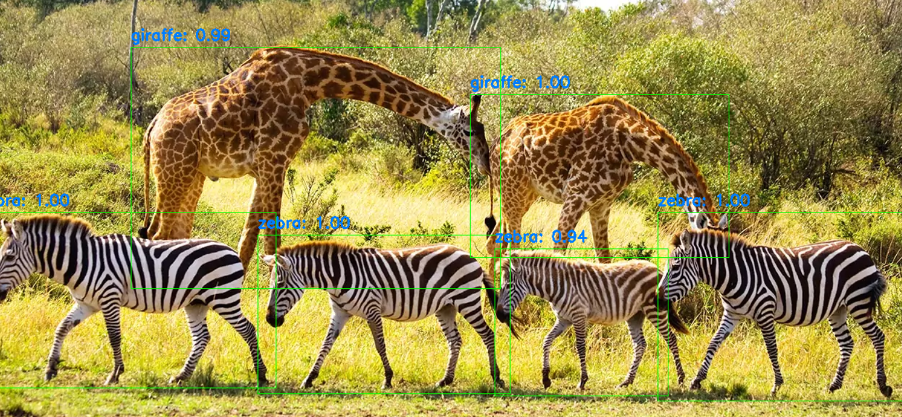
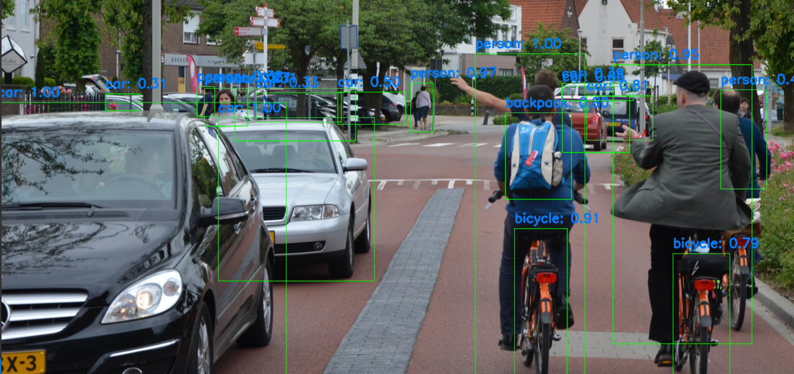

# YOLOv3 Object Detection (Python + OpenCV)

## Introduction

This project demonstrates how to use YOLOv3 for object detection in images and real-time webcam object detection. The implementation is built using **OpenCV's deep learning (dnn) module** and follows a simple, functional approach.

## Key Features

- Fast Object Detection: Uses YOLOv3 for high-speed, real-time detection.
- Pre-trained Model: Loads YOLOv3 weights and configuration.
- Optimized Detections: Applies **Non-Maximum Suppression** to filter overlapping boxes.
- Multi-Image Processing: Automatically processes all images in a folder.
- Webcam Support: Runs object detection on a live webcam.


## Requirements

Make sure you have the following installed:

- Python 3.10
- OpenCV (`cv2`)
- NumPy (`numpy`)

To install dependencies, run:

```bash
pip install opencv-python numpy
```

It's better to have an Anaconda environment to use the project:
[Here](https://docs.anaconda.com/navigator/tutorials/manage-environments/)  you can follow the guidelines to create an Anaconda environment. 

## Project Structure

```
|-- yolo_files/
|   |-- yolov3.cfg      # YOLOv3 model configuration file
|   |-- yolov3.weights  # Pre-trained YOLOv3 weights
|   |-- coco.names      # List of class labels(80 classes)
|-- test_images/        # Folder containing test images
|-- yolov3_image_detection.py  # Script for image detection using YOLOv3
|-- yolov3_webcam_detection.py  # Script for real-time detection using webcam
|-- assets/                     # Folder containing images used in README 
|   |-- detection_1.png 
|   |-- detection_2.png 
|-- README.md           
```

## Getting Started

### Running Object Detection on Images
1. Place your test images in the `test_images` folder.
2. Run the image detection script:
   ```bash
   python yolov3_image_detection.py
   ```
3. The script will analyze each image and display the detected objects.

### Running Object Detection on Webcam
1. Ensure the YOLO model files are in the `yolo_files` folder.
2. Run the webcam detection script:
   ```bash
   python yolov3_webcam_detection.py
   ```
3. The script will activate your laptop’s webcam and detect objects in real time.
4. Press `Q` to exit the webcam detection mode.


## How It Works

The detection process follows these steps:
1. **Preprocess the image:** Resize, normalize, and convert it into a format YOLOv3 expects.
2. **Run YOLOv3:** Perform a forward pass through the YOLO network to get predictions.
3. **Filter results:** Extract class IDs, confidence scores, and bounding boxes.
4. **Apply Non-Maximum Suppression (NMS):** Remove duplicate and overlapping boxes.
5. **Display results:** Draw bounding boxes and labels on the image or video feed.


## Expected Output

When you run the script, it will detect objects in the images or the webcam camera and show results like this:







#### Notes

- The script uses a confidence threshold of `0.3` and an NMS threshold of `0.5` (can be adjusted in the script).

## References

- **YOLOv3 Paper:** Redmon, J., & Farhadi, A. (2018). YOLOv3: An Incremental Improvement. [arXiv:1804.02767](https://arxiv.org/abs/1804.02767)
- **OpenCV Documentation:** [https://docs.opencv.org/](https://docs.opencv.org/)
- **NumPy Documentation:** [https://numpy.org/doc/](https://numpy.org/doc/)

## Author

Ali Samaei

## License

This project is open-source and free to use!

